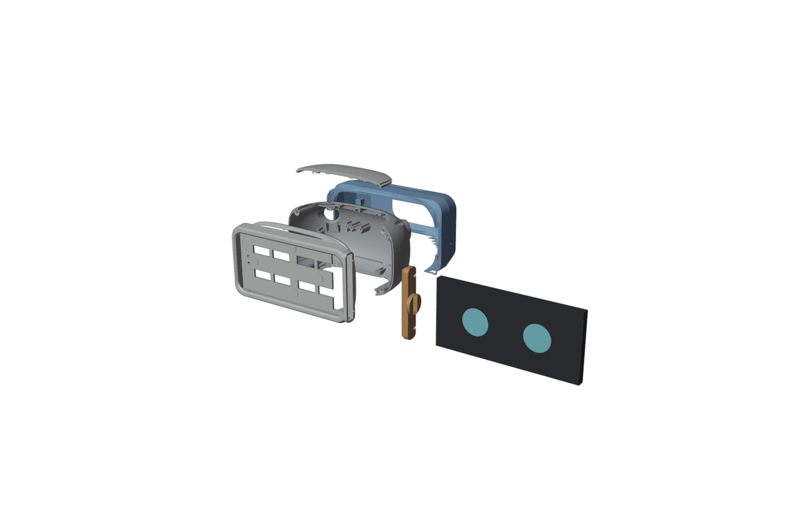
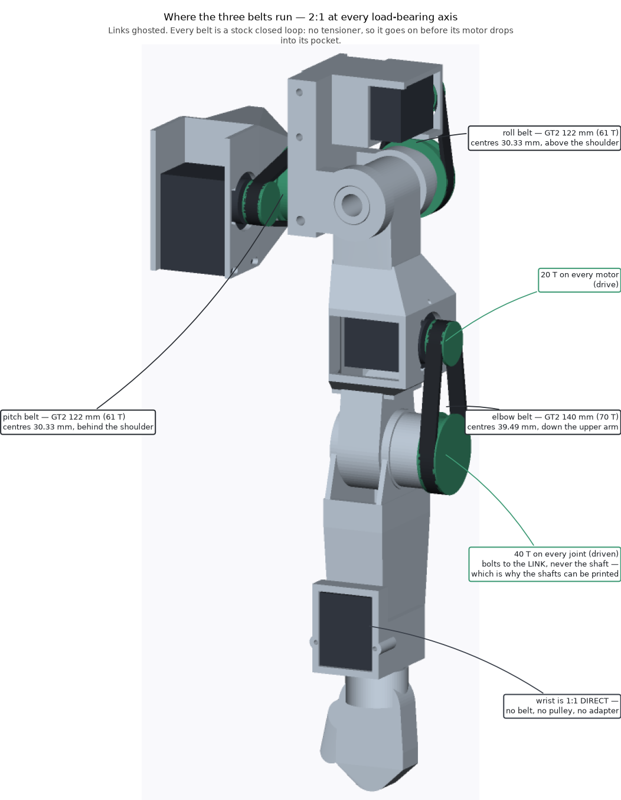
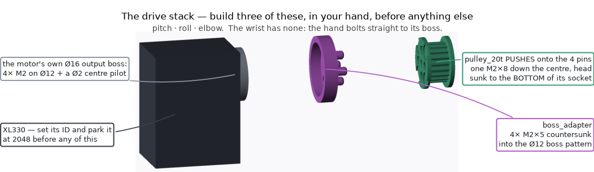
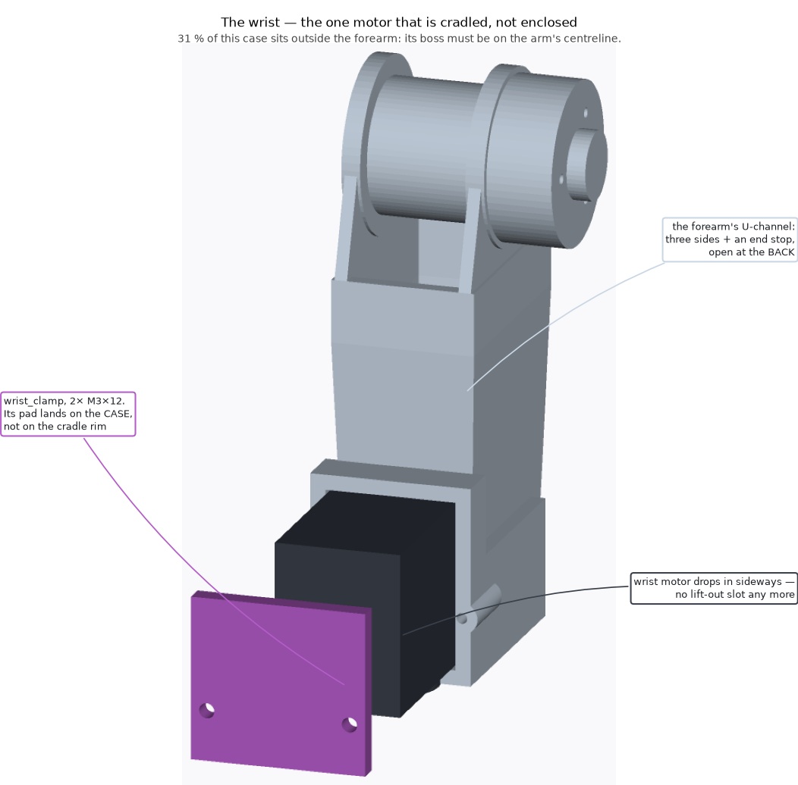
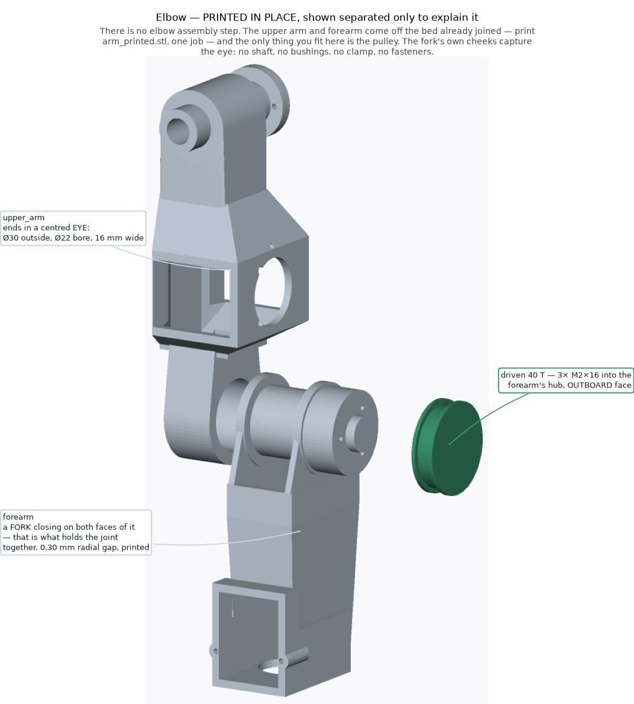
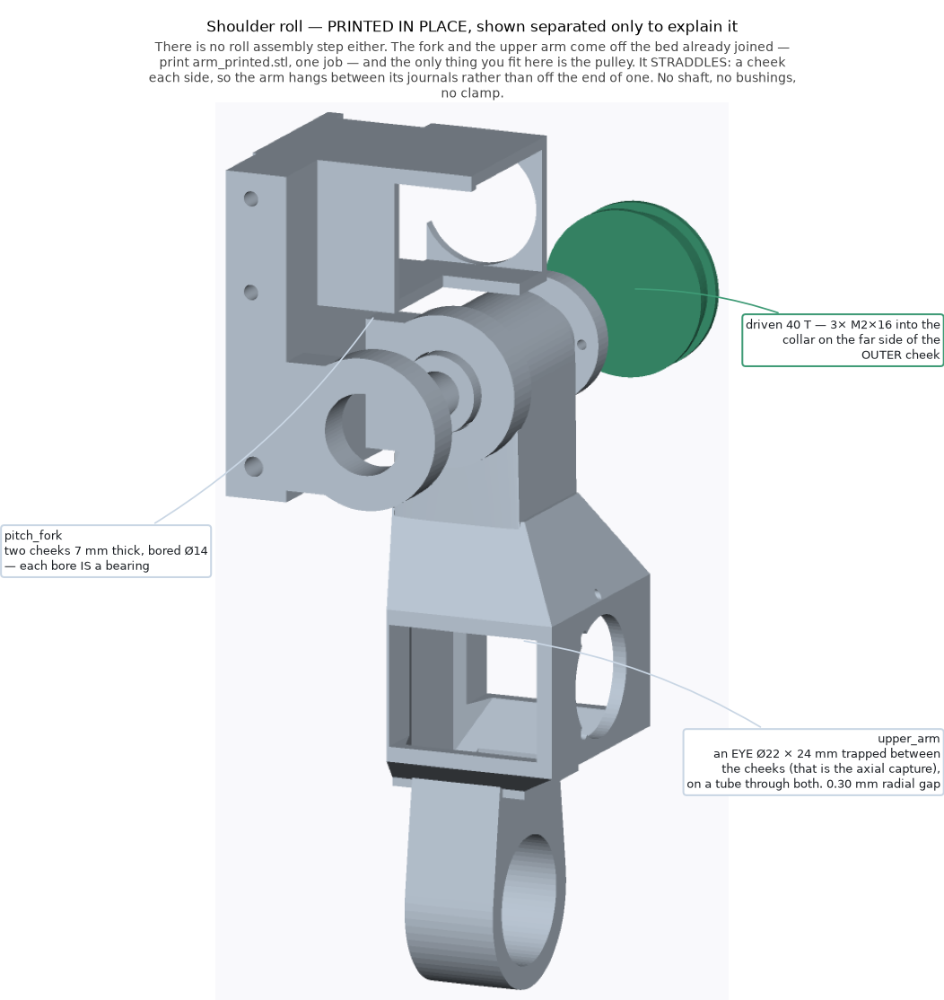
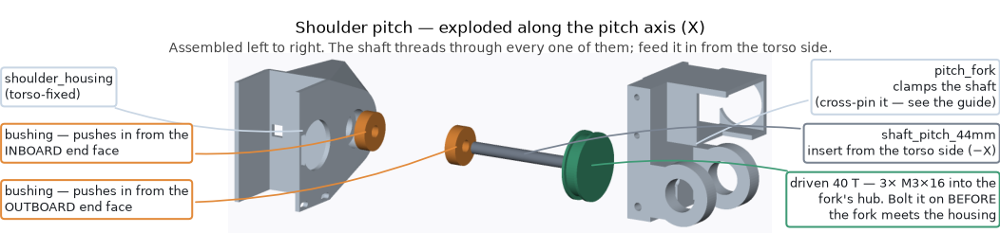
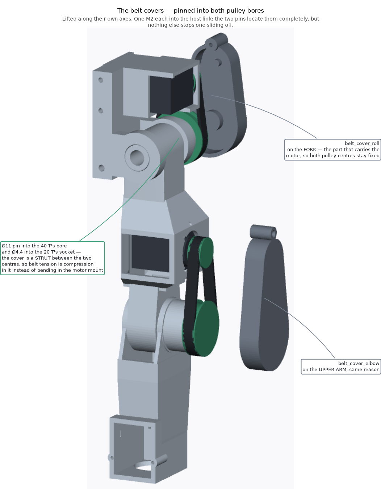
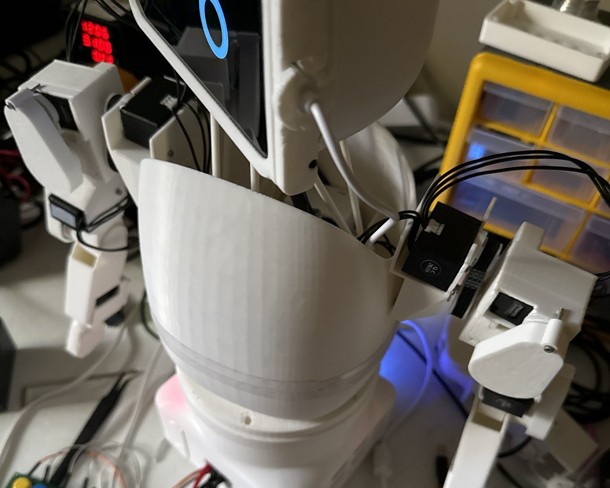
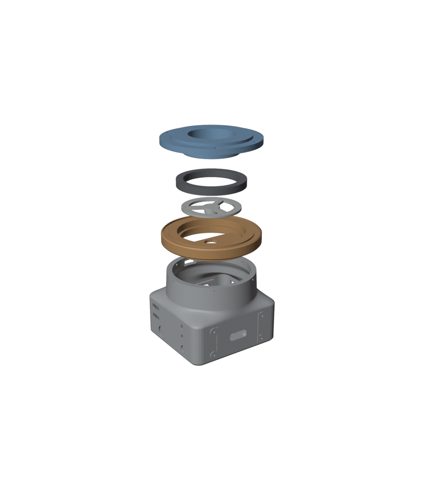

# Stage 3 — Assembly

**The Pi stays on the bench beside you for this whole stage,** with its monitor and keyboard,
the U2D2 plugged in, and the motors on the Power Hub. The head's motor arms are fitted while the
Pi tells you exactly where each motor is, and the head's "level" is recorded on the Pi.

The stock Reachy parts (the motor cages, the neck, the body) go together as the official
**[Reachy Mini assembly guide](https://huggingface.co/spaces/pollen-robotics/Reachy_Mini_Assembly_Guide)**
shows. This chapter says where our robot is different, what order to work in, and what has gone
wrong before.

| Step | What | Who |
|---|---|---|
| [1](#1-rods-balls-and-motor-arms) | Rods, balls and motor arms | Mechanical lead |
| [2](#2-the-head-motors-and-neck) | Head motors and neck, and recording "level" | Mechanical lead + mentor |
| [3](#3-antennae) | Antennae | Mechanical + motors |
| [4](#4-the-face-plate) | The face plate | Mechanical lead |
| [5](#5-the-arms) | The arms | Mechanical lead |
| [6](#6-the-arms-onto-the-body) | The arms onto the body | Mechanical lead + mentor |
| [7](#7-the-base-and-yaw-joint) | The base and the yaw joint | Mechanical lead |
| [8](#8-power-and-cables) | Power and cables | Motors lead + mentor |

> **One program on the motors at a time.** Nothing stops two programs driving the motors at
> once, and they fight. Run one motor command at a time, and never while the robot software is
> running in another Terminal.

---

## 1. Rods, balls and motor arms

The head hangs on six rods. Each rod has a ball joint at **both ends**: a printed ball snapped
into a ring in the rod. Twelve balls for six rods.

**Check before you start.** It must be `rod_v6_eye_rod_122mm.stl` — there is a raised collar
around the ball hole on **both** faces. And **measure every ball with calipers: 9.00–9.10 mm.**
A ball printed small holds half as well; a ball printed big never seats. Sort out any that are
off.

### Swage the balls in (mentor — hot water)

The ball is a tight fit on purpose — that tightness is what keeps the rod on the head.

1. Heat water to **80–90 °C** (PETG needs the lower end).
2. Hold the rod's eye in the water for about 20 seconds (tongs).
3. Push the ball through the ring — it goes in with a firm squeeze, not a click.
4. **Work the joint round in every direction while it cools**, so the ring sets to the ball's
   shape instead of just gripping it.

Push each ball in **once**. Every time a ball is pulled out and pushed back the ring stretches a
little. If a rod feels loose, print a new rod.

### Motor arms

Clean the four small holes and the tip hole with a drill bit turned by hand. Test-fit an
M3 × 18 through the tip hole and an M3 nut into its pocket on the back. **Don't screw the arms
onto the motors yet** — step 2 says how, and the angle matters.

### ✅ Checkpoint 3.1

- [ ] 6 rods (+ spares), each with **both** balls swaged in, swivelling freely, can't be pulled off
- [ ] 6 motor arms, holes cleaned, nut fits its pocket

---

## 2. The head motors and neck

Build the six head motors (IDs 4–9) into their cages following the official guide. What is
different on our robot:

| Official guide | Our robot |
|---|---|
| Metal link rods | Printed `rod_v6` rods, 122 mm between ball centres |
| Stock motor arms | Printed `arm_30mm` arms, 4 × M2 × 5 self-tapping into the motor's round boss |
| Camera, lens and speaker in the head | **Not fitted** — the phone does all three |
| `head_front` | Replaced by the S10 face plate (step 4) |

The six head motors sit in three pairs around the centre, **facing inward**: each motor's round
output boss points at the centre column, so its arm swings in an upright plane beside the motor.
At the resting pose every arm is **level**, the two arms of a pair point **away from each
other**, and the rod's ball sits on the arm's inner face. Match the picture in the official
guide before you tighten anything.

**Which motor goes where.** The software doesn't care which cage holds which ID, but all six
robots use the same layout so they can be compared: **ID 4 drives the rod into neck hole 1,
ID 5 into hole 2 … ID 9 into hole 6** (the neck plate's holes are numbered). Write it in the
team log.

### Fitting the arms — where "level" lands matters (mentor)

A motor reports its angle as a number from 0 to 4095, and the number **jumps** from 4095 back to
0 at one point in the turn (the *seam*). If an arm's level position lands near the seam, the
software thinks the arm has spun right round when it crosses it. That happened on Ollie and
cost an arm removal to fix. So:

1. Motors in their cages, **no motor arms fitted**, the Power Hub on.
2. Send every motor to the middle of its range (2048):
   ```bash
   cd ~/reachy
   .venv/bin/python -m scripts.calibrate show
   .venv/bin/python -m scripts.calibrate home
   .venv/bin/python -m scripts.calibrate home
   .venv/bin/python scripts/motor_status.py --ids 4,5,6,7,8,9
   ```
   `show` must print a path ending in `reachy/data/motor_calibration.json`, then
   `(defaults)` — and a warning that the file is unusable. That's expected here: your robot has
   no calibration file yet, and that is what makes "home" mean 2048. `home` runs twice because a
   long move can be cut short when the script lets go. Afterwards `motor_status` should read
   about 2048 (±20) on every head motor. The motors go limp but stay where they were sent.

   ⚠️ **`show` first, every time.** It is the only `calibrate` command that moves nothing —
   every other one switches the motors on and drives them to "home" straight away.

3. Without turning the motor, fit its arm in whichever of the **four bolt positions is
   closest to level, pointing away from its pair partner**. It won't be exactly level — the bolt
   pattern only goes on in quarter turns — and that's fine.
4. Screw it down with 4 × M2 × 5 (small screws in plastic — snug, not tight).

### Record "level" — before any rod goes on (mentor)

This is the moment it's easy: six loose arms and a spirit level. With the rods on, the arms
can't be set level one at a time.

1. Hold each head motor's arm **level** — a small spirit level, or a phone level app laid along
   the arm. The motors are limp; the arms stay where you put them.
2. Read all six:
   ```bash
   .venv/bin/python scripts/motor_status.py --ids 4,5,6,7,8,9
   ```
   Write the six positions (`pos`) in the team log, in ID order.
3. **Each must be between about 1000 and 3100.** Closer to 0 or 4095 than that and the arm's
   travel crosses the seam — take that arm off, move it one bolt position, and read it again.
4. Make your robot's calibration file from the template and put your numbers in it:
   ```bash
   mkdir -p data
   cp calibration-template.json data/motor_calibration.json
   nano data/motor_calibration.json
   ```
   Replace the six `2048`s after `"neutral"` with your six readings, in ID order 4–9. Leave
   everything else alone. **Ctrl-O** then **Enter** saves; **Ctrl-X** exits.
5. Prove the file reads:
   ```bash
   .venv/bin/python -m scripts.calibrate show
   ```
   It must say **`(loaded)`** and show **your** six numbers.
6. Copy `data/motor_calibration.json` onto the USB stick as `calibration-R3.json` (your robot's
   number). It was measured on this robot and can't be made again.

From here on, "home" sends the head to **level** instead of 2048 — which is what makes it safe
to run with the rods fitted. **`show` must say `(loaded)` before any `home`.** If it ever says
`(defaults)` — a typo in the file, a missing comma — stop: with the rods on, 2048 binds the
head. (Appendix B explains the rest of the file.)

### Rods

Each rod: an **M3 × 18** goes through the bottom ball into the motor arm's tip, with the nut in
the pocket behind. An M3 through the top ball fixes it into its numbered hole under the neck
plate.

⚠️ **The one screw rule that matters.** Tighten until the ball has no wobble, then **back off a
hair until it swivels freely** under finger pressure. A clamped ball joint makes the head stiff
and stops it reaching its angles — on Ollie, over-tight neck screws were most of why the head
"couldn't get its range".

### Cables

The six head motors are daisy-chained. **Hot-glue or zip-tie every connector** so the head's
movement can't pull one half out. On Ollie, a motor dropping off the bus when a cable was nudged
was a regular fault until every connector had strain relief.

### ✅ Checkpoint 3.2

- [ ] `calibrate show` says `(loaded)` with your six level readings, all between 1000 and 3100
- [ ] The calibration file is backed up on the USB stick
- [ ] With the motors unpowered, the head moves by hand through nod, tilt and turn with no
      binding or clicking, and no rod pops off
- [ ] Every rod-top screw passes the "swivels freely" test
- [ ] A scan still finds all six head motors (the cables survived)

---

## 3. Antennae

The two antenna motors (**M077**, IDs 1 and 2) sit in the printed holders inside the back of
the head, shafts pointing backwards. The hub goes on the motor and the wire goes in the hub.

1. Build each antenna motor into its holder (left and right holders are different parts).
2. **Plug in one antenna motor (power off), then scan.** It must appear alongside the others. On
   Ollie, plugging the antennae in once killed the whole bus — every motor went silent — and the
   cause was never found. One at a time tells you immediately which one it is.
3. Send it to the middle of its range: `calibrate show` — **must say `(loaded)`** — then
   `calibrate home` twice.
4. **Make the antenna:** stiff wire (brass or steel), bent by hand with a small coil a little
   above the hub — the coil is what makes it bounce. Ollie's are in the photo on the first page.
   Measure the hole in the antenna hub and pick wire that is a snug push fit; make it about the
   height of Ollie's (the stock antenna is about 165 mm). **Round off the top end** with a file
   or a blob of hot glue — children will touch it.
5. Fit the hub, and push the wire in so it points **straight up**. That keeps the antenna's
   swing clear of the motor's seam.
6. Repeat for the other antenna, then strain-relieve both cables.
7. **Record the antennae's centre:** with both wires pointing straight up, read them:
   ```bash
   .venv/bin/python scripts/motor_status.py --ids 1,2
   ```
   Open `data/motor_calibration.json` in `nano` again and put the two readings in as the
   `center` of `antenna_left` (ID 1) and `antenna_right` (ID 2). Set each one's `min` to its
   centre minus 1024 and `max` to its centre plus 1024. Save, run `calibrate show` (must say
   `(loaded)`), and copy the file to the USB stick again.

Nothing may sit in the antennae's path: they swing through a band across the top and back of
the head.

### ✅ Checkpoint 3.3

- [ ] A scan shows 1 and 2 **and** 4–9 all at once
- [ ] Each antenna swings freely by hand (unpowered) through its whole range without hitting
      the head, and its tip is rounded
- [ ] The antennae's centres are in the calibration file, and it still says `(loaded)`

---

## 4. The face plate

The face is a **Samsung Galaxy S10** mounted sideways behind the face plate. Its screen draws
the eyes and its speaker is the voice. The plate goes on now; **the phone goes in during Stage
4**, once it has been set up and paired — it slides in from the side, so the head doesn't have
to come apart for it.



*The head, pulled apart: the stock head back (grey) with the crown cover above it, the S10 face
plate (white) in front, the service cap (orange) and the phone beside it — it slides in
sideways — and a back shell (blue) behind. The back shell is only needed for a head designed in
Stage 6.*

1. Offer the face plate up to `head_back` the way the original face went on: tabs into the six
   slots, the locating nubs register, then the **original four screws** in from the back.
2. Clip `head_mic` into the slot across the crown.
3. Keep the service cap and its two M2 × 10 screws in the bin until Stage 4.
4. **Plan the phone's charging cable now.** Ollie's phone stays plugged in: a USB-C cable leaves
   the head beside the service cap and runs down behind the head into the body (you can see it
   in the photo on the first page). It needs enough slack for the head to nod, tilt and turn the
   whole way, and it must be tied where it can't catch in the neck rods. It ends at the phone's
   USB charger in the base (step 8).

⚠️ **Weight.** The phone is 157 g on the front of a head held up by six small motors. Don't add
anything to the head that isn't in the design.

### ✅ Checkpoint 3.4

- [ ] Face plate on with its four screws; the top of the head is closed (`head_mic` fitted)
- [ ] The phone's cable route is planned and the cable is in the bin

---

## 5. The arms

Each arm has four motors: **shoulder pitch** (swings the arm forward and back), **shoulder
roll** (lifts it out to the side), **elbow**, and **wrist**. The first three drive their joints
through belts at 2:1; the wrist drives the hand directly.



*One arm, with the belts shown: the pitch belt behind the shoulder, the roll belt above it, the
elbow belt down the upper arm. Every belt is a closed loop with no tensioner, so it goes on
before its motor goes into its pocket.*

**Before you start:**

- **Sort the parts into two piles, left and right.** `arm_printed`, the roll belt cover and the
  motors (14–17 right, 18–21 left) are different for each side. On a finished arm, whichever
  side it is, **the elbow belt runs down the outboard face of the upper arm, and the roll pulley
  faces forward.** If your dry fit puts them the other way, you have the other arm's part.
- **Which motor goes where** — check the labels from Stage 2 as each one goes in:

  | Joint | Right arm | Left arm | Where it sits |
  |---|---:|---:|---|
  | Shoulder pitch | 14 | 18 | In the shoulder housing |
  | Shoulder roll | 15 | 19 | On the fork, above the shoulder |
  | Elbow | 16 | 20 | Lying flat in the upper arm |
  | Wrist | 17 | 21 | In the forearm's cradle |

- **The belts** (per arm): two **122 mm** GT2 loops (pitch and roll — the same belt, so nothing
  to mix up) and one **140 mm** loop (elbow), all 6 mm wide.
- **No need to position the arm motors first.** Unlike the head, the arm's zero is recorded
  after the arm is built (Stage 4), so the motors can be at any angle when the belts go on.

**Work from the hand inward.** A closed belt has no slack, so each one is looped over both its
pulleys while the motor is loose in your hand, and only then does the motor slide into its
pocket. Every step below keeps the screwdriver's path open for the next.

### Step 1 — Break the printed joints loose

The `arm_printed` part came off the printer with its elbow and shoulder joints already made.
Straight off the bed the gaps may be lightly stuck together. **Work the elbow first, gripping the
forearm close to the joint** — a long lever on a stuck joint snaps a 3 mm cheek off instead of
freeing it, and that is exactly how the first arm was lost. Then work the shoulder. Both should
turn by fingertip. **If either won't move at all, stop** and tell the mentor — don't force it.

### Step 2 — Bushings and the pitch pulley

1. Press the **two bushings** into the shoulder housing, one from each end face of its bearing
   barrel. Press them square in a vice with a flat plate. **Test the first one**: it should need
   a firm push and then stay put, and the printed shaft should turn freely in it afterwards.
2. **Bolt the pitch 40-tooth pulley onto the fork now** — its inboard face (the side that will
   face the body), 3 × M2 × 16 straight into the printed hub. Once the arm is in the housing
   those screws can't be reached. Snug, not tight: you're cutting a thread in plastic. The
   pulley's flange must sit flat on the hub face with no gap.

### Step 3 — Drive stacks (pitch, roll and elbow motors)

For each of the three belted motors, in your hand:

1. `boss_adapter` over the motor's round boss, 4 × M2 × 5 **countersunk**. Each head ends up
   flush or just below the plate's top face. Snug only.
2. `pulley_20t` drops onto the adapter's four drive pins.
3. One **M2 × 8** down the centre. Its head sits at the **bottom** of the pulley's socket, not
   flush at the top — the space above it is where a belt cover's pin goes.

Spin it and watch the flange: any wobble means the adapter isn't seated on the boss.



*The drive stack: motor, boss adapter, 20-tooth pulley, centre screw.*

### Step 4 — Hand and wrist

1. Drop the wrist motor (17 / 21) into the forearm's cradle from the back, and bolt the
   `wrist_clamp` across the opening with 2 × M3 × 12.
2. `hand_adapter` onto the wrist motor's boss — 4 × M2 × 5 countersunk, **while you can still
   reach them**.
3. Push the hand onto the adapter until the snap clicks. No screws in the hand.



*The wrist motor drops into the forearm's cradle from the back and the clamp bar holds it.*

### Step 5 — Elbow

1. Loop the **140 mm** belt over a 40-tooth pulley and over the elbow motor's 20-tooth pulley,
   motor still loose.
2. Bolt that 40-tooth pulley to the forearm's elbow hub — 3 × M2 × 16, on the **outboard**
   face — with the belt still around it.
3. Slide the elbow motor (16 / 20) into the pocket in the upper arm **from the back** — it lies
   flat, long side front to back. Fix it with 2 × M2 × 6 and washers through the front face.



*The elbow: the belt goes on first, then the motor slides in from the back.*

### Step 6 — Shoulder roll

1. Loop a **122 mm** belt over the roll motor's 20-tooth pulley, and over a 40-tooth pulley.
2. Bolt that 40-tooth pulley to the collar on the **far side of the fork's outer cheek** —
   3 × M2 × 16. It drops onto a round spigot and should go on with a firm push and no rock.
3. Drop the roll motor (15 / 19) onto the fork's cradle from the outside, and fix it with
   2 × M2 × 20 through the back face.



*Shoulder roll: the belt over both pulleys, then the motor down onto the fork's cradle.*

### Step 7 — Shoulder pitch

1. Loop a **122 mm** belt over the fork's pitch pulley (fitted in step 2) and the pitch motor's
   20-tooth pulley.
2. Slide `shaft_pitch_44mm` in **from the body side**: through both housing bushings, through the
   pulley, and into the fork's pitch hub. Fit whichever collar (2, 3 or 4 mm) stops the shaft
   sliding end to end.
3. **Pin the shaft to the fork** (mentor): drill **2.5 mm straight up from the underside of the
   fork's back plate**, through the hub and the shaft together, and drive in an M3 self-tapping
   screw or a 2.5 mm pin. This is the only thing that stops the shaft walking out. Don't skip it.
4. Lower the pitch motor (14 / 18) into the housing's bay **from above**. Start its two M2 × 6
   screws in the lower pair of slots, finger tight.
5. **Tension the belt:** put a small flat screwdriver through the little window in the front
   of the bay and lever the motor backwards against the belt, then tighten the two screws while
   you hold it there. A fraction of a millimetre is normal.



*Shoulder pitch: the shaft goes in from the body side; the motor drops into the housing from
above. (The picture's label says M3 × 16 for the big pulley — that's out of date: it's
M2 × 16, as in step 2.)*

### Step 8 — Belt covers

Last, once both belts are on and both motors are fixed. Each cover pins into the bore of both its
pulleys and is held by one **M2 × 16 countersunk** screw.

1. Line the big pin up with the 40-tooth pulley's bore and the small pin with the 20-tooth
   pulley's socket, and drop it on. **Both pins are loose, and that's right** — each pulley
   keeps turning under its pin. Never force a cover on.
2. Drive the screw through the cover into the fork (roll) or the upper arm (elbow). **Nip it up,
   don't crank it.**
3. **Spin each pulley with a fingertip before and after the screw goes in.** Stiff before means a
   pin is too tight in its bore; free before and stiff after means the screw is too tight.

The pitch belt has no cover — it's walled in by the body.



*The two belt covers, lifted off. Each one is also a strut that holds its two pulleys apart.*

**Belt tension, all three:** a belt should give a couple of millimetres under a firm thumb in the
middle and make a dull thud, not a note. Too tight wears out the motor's bearings.

### ✅ Checkpoint 3.5

- [ ] Both arms built, every motor in the right place for its label
- [ ] With the motors unpowered, every joint turns by hand through its range with nothing rubbing
      and no belt jumping teeth
- [ ] Each pulley turns under its belt cover
- [ ] The pitch shaft is pinned on both arms
- [ ] A scan finds 14–17 and 18–21

---

## 6. The arms onto the body



*Ollie's shoulders: each shoulder housing is screwed to the top of the body, where the shell
narrows, and the arm hangs outside it. The motor cables go in over the top.*

The shoulders screw straight through the body shell. There's no printed bracket for this —
Ollie's were fitted by hand — so **R1 works out the exact position first, with the mentor, and
writes it down** (distance below the top rim, distance from the front seam) so all six robots
match. After that, a paper template taken off R1's body lets the other teams mark and drill
their shell before anything is inside it.

1. Hold each arm where Ollie's is: its shoulder housing at the top of the body where the shell
   narrows, one on each side and level with each other, the arm hanging outside the shell.
2. Mark the housing flange's four holes onto the shell, then drill **3.2 mm** (a small pilot
   hole first). Clean off the swarf, and keep it out of the head motors below.
3. Bolt each housing on with **4 × M3 screws and nuts** (R1 confirms the length — about 12 mm).
4. Run both arms' motor cables in over the top of the body to the motor chain, as in the photo.
   Leave enough slack for the arm's full swing, and strain-relieve every connector.

### ✅ Checkpoint 3.6

- [ ] Both shoulders solid on the body, at the same height, with no rocking
- [ ] With the motors unpowered, the head moves by hand through its whole range without touching
      either shoulder or an arm cable
- [ ] Each arm swings through its range without hitting the body
- [ ] A scan still finds 1–9 and 14–21

---

## 7. The base and yaw joint

The robot stands on a printed plinth with a **6816 bearing** on top. The body-turn motor (ID 3)
hangs under a bridge in the top of the base and turns the rotor directly. Cables go straight up
through the middle of the bearing.



*The base, pulled apart, bottom to top: the plinth (grey), the stator cap (orange) with the yaw
motor hanging under its bridge, the clamp and drive hub (white), the 6816 bearing (dark), and
the rotor (blue) that the body sits on.*

Do it in this order — it's the order in which every screw can still be reached:

1. Electronics into the plinth (step 8 says what goes where). The top opening is ⌀117 mm.
2. **Yaw motor** up under the cap's bridge, boss through the hole: 4 × M2 × 8 down through the
   bridge. Send it to the middle of its range first (`calibrate show` must say `(loaded)`, then
   `calibrate home` twice), and **don't turn it by hand after that**. When you choose which
   holes line up in steps 3 and 6, pick the combination that leaves the body **facing forward**
   (within about 15°). The body turns 90° each way; starting from the middle keeps that clear of
   the motor's seam.
3. **Clamp / hub** down onto the motor's boss: 4 × M2 × 10.
4. **Bearing** into the cap's pocket.
5. **Rotor** spigot down through the bearing onto the clamp.
6. 3 × M3 × 8 countersunk **up from below** at 30°, 150° and 270°, in the hole combination you
   chose in step 2.
7. **Four brass spacers** into the rotor's pockets, then lower the **body** onto the rotor's
   ring. The body's own four clamshell screws (the longer ones) go **up from under the rotor**,
   through the spacers, into the body — one set of screws holds the body shut and holds it on.
8. **Cap into the plinth:** 6 × M3 × 14, sideways through the drum wall.
9. **Record the body's centre:** with the body facing straight forward, run
   `motor_status.py --ids 3` and put the reading into the file as the `center` of `body_yaw`,
   with `min` 1536 below it and `max` 1536 above it (both must stay inside 0–4095). Save, `show`
   must say `(loaded)`, and back the file up to the USB stick.

To service the base later, undo the six screws in step 8 and the whole robot lifts off with the
joint intact.

**Cable loop.** The body turns up to 90° each way, carrying the head, the arms and every cable
with it. Leave enough slack in the cables passing up through the middle that a full turn each
way pulls on nothing, and tie them so they can't rub on the bearing or a printed edge.

### ✅ Checkpoint 3.7

- [ ] With the yaw motor unpowered, the body turns smoothly by hand 90° each way with all cables
      connected — no rubbing, no tugging
- [ ] The body doesn't rock on the rotor
- [ ] The body's centre is in the calibration file

---

## 8. Power and cables

```
 wall ─ 12 V brick ─┬─► 12→5 V converter ──► U2D2 Power Hub ──► all 17 motors
                    └─► 12→5 V USB charger ──► USB-C cable up through the body ──► phone

 wall ─ official Pi 27 W supply ──► Raspberry Pi 5 ──USB──► U2D2 ──► Power Hub (data)
```

The 12 V side — the brick, the fuse, the switch and the converters — is **mentor work** and is
wired and measured as [Appendix B](MENTOR_SETUP.md) describes. The Pi keeps its own official
supply: a general-purpose 5 V supply measured too low on Ollie and made the Pi crash.

1. **Mentor: measure the motor supply before any motor is connected** — probes on the Power
   Hub's input, power on: **about 5.0 V**. If it says 12, stop.
2. Power Hub into its tray (4 × M3 from above), tray into the rails in the plinth. The
   converters go in the plinth too.
3. The Pi goes in its case: Active Cooler on, Pi on the standoffs (4 × M2.5 × 8), cover on.
   The case **stands on the table** beside the plinth and bolts to its right side
   (4 × M3 × 16) — the screws only locate it, the table carries it.
4. Short USB cable from the Pi to the U2D2, inside the base.
5. Motor chain from the Power Hub up through the yaw joint to the body, then on to the head and
   both arms.
6. The phone's charging cable from the USB charger up through the yaw joint and the body to the
   head (the route you planned in step 4).
7. **Tie down every cable in the base.** Nothing loose, nothing crossing the yaw joint or a
   printed edge where it can rub. On Ollie, the motors once lost power for eleven minutes and came
   back only when the cables in the base were moved — most likely a short from a loose wire.

Leave the monitor and keyboard on the Pi: you need them for Stage 4.

### ✅ Checkpoint 3.8

- [ ] 5 V measured at the Power Hub before the motors were connected
- [ ] With the Pi running and the motors powered, a scan from the Pi finds all 17 motors
- [ ] No loose cable anywhere in the base; the body still turns freely 90° each way
