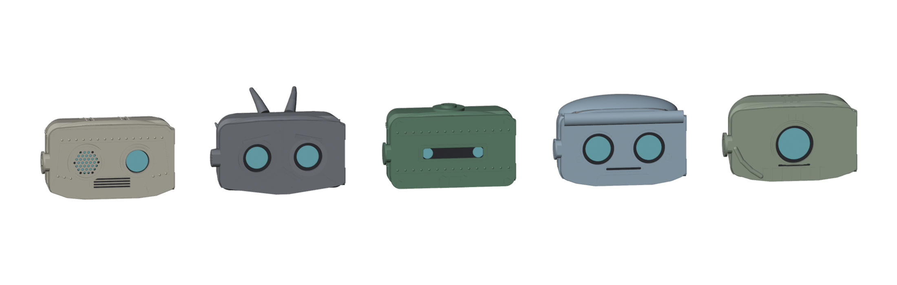
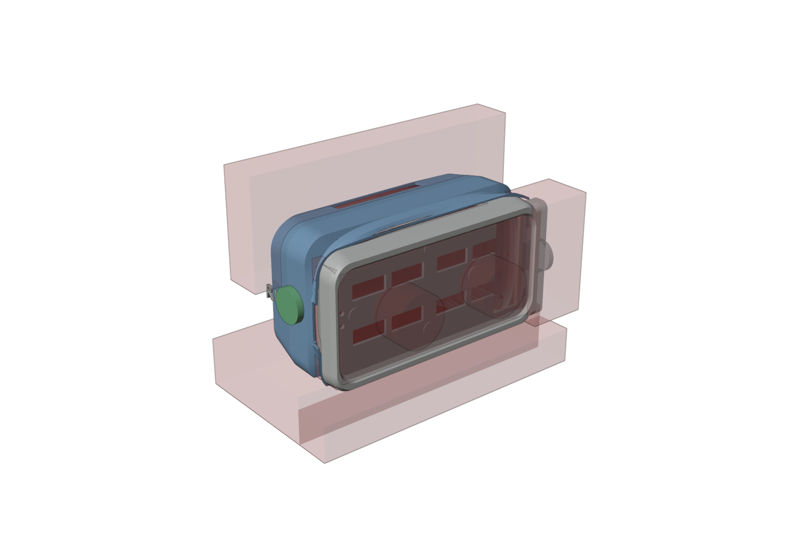

# Designing your robot's head in Blender

Every robot gets the same neck, body and base — they hold motors, a phone and a computer, and
their shapes are measured to a fraction of a millimetre. **The head is yours.** You start from
the standard head and add to it: ears, horns, a crest, a visor, a badge, your robot's name
engraved on its side. A script checks your design against every rule below and exports the
file you print.



*The character heads designed for the original robot — tinhead, vex, boiler, pip and iris.
Every one fits the same neck and the same phone. Yours will too.*

---

## 1. Set up

1. Install **Blender 4.5 LTS** from [blender.org](https://www.blender.org/download/) (any
   version from 4.2 up works). It's free and runs on Windows, Mac and Linux.
2. Optional but useful: the **3D Print Toolbox** add-on. *Edit ▸ Preferences ▸ Get
   Extensions*, search "3D Print Toolbox", **Install**. It checks wall thickness and overhangs.
3. Get the starter file, `reachy_head_starter.blend`, from the `blender/` folder — in the
   ollie-3d repository, or on your team's USB stick.
4. Open it, then straight away **File ▸ Save As** into your own folder, named after your robot
   (`R3-nova.blend`). Never work in the original.

## 2. What's in the starter file



| Colour | What it is | Can you change it? |
|---|---|---|
| **Blue** | The back shell — the part that slides over the back of the head | No — it's locked. You add to it |
| **White** | The face plate that holds the phone | No — locked. You can add small details to it |
| **Grey, see-through** | Parts inside and underneath: the stock head back, the crown cover, the body, the service cap, the phone | No — they're there so you can see what you're designing around |
| **Red, see-through** | **Keep-out zones** — nothing you make may go in them | No |
| **Green** (hidden) | Two examples: an ear disc and an engraved label | Copy them, move them, delete them |

The Outliner (top right) has two collections that are yours:

- **MY ADD-ONS** — every object you want to *add* to the head goes here.
- **MY CUTS** — every object you want to *carve out* of the head (engraved letters, grooves)
  goes here.

Anything outside those two collections is ignored when you export. To move an object into one,
select it, press **M** and pick the collection.

**Units are millimetres.** The face looks toward **−Y**. Handy views: **Numpad 1** front,
**Ctrl + Numpad 1** back, **Numpad 3** side, **Numpad 7** top. No numpad? *Edit ▸ Preferences ▸
Input ▸ Emulate Numpad*, then use the number row.

## 3. The rules

The check script tests all of these for you. Knowing them first saves you redesigns.

| Rule | Why |
|---|---|
| **Sink every add-on about 1 mm into the surface.** | If it only touches the surface it prints as a separate piece and falls off |
| **Stay out of the red zones.** | Each one is something your design would break: the inside of the head, the phone's pocket, the eyes, the phone's glass, the service cap (the phone slides out there to charge), below the head (the neck and body), and the **antenna band** across the top and back, where the antennae swing |
| **Back shell: 65 g or less in total.** The plain shell weighs about 45 g, so you have about 20 g to add. **Face plate: 15 g or less added.** | Six small motors hold up the head and a 157 g phone. Weight on the head is the one thing they can't argue with |
| **Size:** no more than 88 mm out to each side, 75 mm up, 52 mm back, and face details no more than 5 mm proud of the face | Bigger heads hit things when they turn, and cost motor strength |
| **Nothing below the head.** | The head nods, tilts and turns right down to the body. The check swings your add-ons through every pose and fails anything that gets closer to the body than the standard head already does |
| **Engravings no deeper than 0.8 mm.** | The shell wall is only 1.6 mm thick |
| **Don't cover the phone's camera** if your design covers part of the screen. | The camera, near one end of the screen, is how the robot sees who is talking. The check can't see it — hold your print up to the phone and look |
| **Nothing thinner than 1.2 mm. Round every point and edge** — at least 1 mm radius on tips. | Thin bits snap. **Children will touch this robot** |
| **Each add-on and cut is its own closed object.** | Open meshes (holes, loose edges) can't be printed. Text objects are fine as they are |
| **Nothing crosses the line where the face meets the back shell.** | They are separate prints. A crest that runs from face to crown is two objects, split at that line |

## 4. Make an add-on

The example **ear disc** shows the pattern. Turn on the green EXAMPLES collection (the eye icon
in the Outliner) to see it.

1. **Add ▸ Mesh ▸ Cylinder** (or Cone, UV Sphere, Cube…).
2. Press **N** for the side panel. Type exact numbers into *Location*, *Rotation*, *Dimensions*.
3. Push it into the surface until about 1 mm is buried. Check it from two views.
4. **M ▸ MY ADD-ONS.**

Shaping tips:

- **Round it** with a *Bevel* modifier (width 1–2 mm, segments 3) — modifiers count; the
  check uses the finished shape.
- **Smooth it** with a *Subdivision Surface* modifier.
- **Horns and fins:** start from a cone, then *Edit Mode* (**Tab**) with proportional editing
  (**O**) to curve it.
- **Sculpting** is fine on **your own** objects. Afterwards add a *Remesh* modifier
  (Voxel, 0.5 mm) so it is a closed solid.
- **Mirror** left and right with a *Mirror* modifier (axis X) — both sides for the price of one.
- **Save weight:** hollow a big add-on with a *Solidify* modifier (thickness 1.6 mm), keeping
  it closed.

## 5. Engrave something

The example **engraved label** shows the pattern.

1. **Add ▸ Text.** **Tab** to edit it, type your robot's name, **Tab** again.
2. In the green **"a"** (Object Data) tab: *Geometry ▸ Extrude* = **1.0 mm** (that makes it
   2 mm deep in total), *Size* = 10–14 mm. Chunky fonts engrave best; letters under 8 mm tall
   are hard to read.
3. Rotate it so its face points out of the surface, and place it so it cuts **0.8 mm** in.
4. **M ▸ MY CUTS.** The check shows cuts as wireframe so they don't hide what they cut.

**Raised letters** are the same object put in **MY ADD-ONS** instead, sunk 0.5–1 mm.

## 6. Check and export

1. Save (**Ctrl + S**).
2. Click the **Scripting** tab at the top. `reachy_check.py` is open in the text editor.
3. At the top of the script, set your robot and design name:
   ```python
   ROBOT = "R3"
   DESIGN = "nova-horns"
   KEEP_ANTENNAE = True    # False only if your robot has no antennae
   ```
4. Press **Run Script** (▶, or **Alt + P**). The report appears in the text editor.

A passing report looks like this:

```
REACHY HEAD CHECK  -  R3 / nova-horns   (antennae kept)

ADD-ONS
  OK    horn_left (shell): closed, attached, clear of every keep-out zone
  OK    horn_right (shell): closed, attached, clear of every keep-out zone

CUTS
  OK    name (shell): closed, attached, clear of every keep-out zone

HEAD MOVEMENT
  OK    Swept 135 head poses: your add-ons never come closer to the body than
        the standard head does (nearest 55.5 mm, at pitch +25, roll +20, ...)

WEIGHT
  OK    back shell: 47.4 g of 65 g
  NOTE  face plate unchanged - print the standard s10_face_plate.stl

RESULT
  PASS - exported:
         .../export/R3_nova-horns_shell.stl
```

**PASS** means your STL files are in the **export** folder beside your `.blend`. **FAIL** means
nothing was exported. Fix each line marked **FIX** and run it again:

| The report says | Do this |
|---|---|
| *reaches inside the head* | Pull it outward. Only ~1 mm should be buried |
| *reaches in where the face plate slots into the shell* | Move it back from the front edge of the shell by a few mm |
| *covers an eye* / *would press on the phone's glass* | Move it off the eye circles; keep masks in front of the face |
| *blocks the service cap* | Keep the service-cap side of the face clear — the side with the small screwed-on cap (+X) |
| *the antennae swing through there* | Move it forward or back out of the band across the crown |
| *doesn't touch* | Sink it about 1 mm into the surface |
| *isn't a closed solid* | *Mesh ▸ Clean Up ▸ Fill Holes*, or 3D Print Toolbox ▸ *Make Manifold* |
| *crosses the line where the face plate meets the back shell* | Split it into two objects, one each side |
| *comes within … mm of the body* | Make the lower part of your design smaller or higher up |
| *… g of 65 g* failing | Make add-ons smaller, or hollow them (Solidify) |

To look at exactly what will be printed, turn on the **RESULT** collection in the Outliner.
For a last check, select `PRINT_shell` and run 3D Print Toolbox ▸ *Check All* — thin walls and
steep overhangs show up there.

## 7. Print it

- **Back shell:** collar-down (the open front edge flat on the bed), PETG, 3 walls, 15 %
  infill, 0.2 mm layers. Tall horns may want a few supports.
- **Face plate with raised details on the front:** print it **face up** (the flat rear band on
  the bed), with supports only inside the phone tunnel. The plain face plate prints face down,
  but raised details would be on the bed.
- **Weigh it** on a kitchen scale. The shell must come in at 65 g or less.
- **Colour:** paint with acrylic over a primer, or change filament at a layer height in the
  slicer (a colour band costs nothing in weight).

The shell slides onto the back of the head and grips by itself. No screws, so you can swap
heads in seconds.

## Going further

Want a completely new silhouette, not add-ons on the standard one? The character heads were
generated from numbers in Python in the robot's main repository
(`hardware/heads/generate_characters.py`, specified in
`hardware/heads/CHARACTER_SPEC.md`), so the fit to the robot is exact. Describe your shape
to your mentor. The mentor can also make a starter file from any of the character shells:

```bash
blender -b --factory-startup -P hardware/heads/blender/make_starter.py -- \
    --shell character_pip_shell --out pip_starter.blend
```
