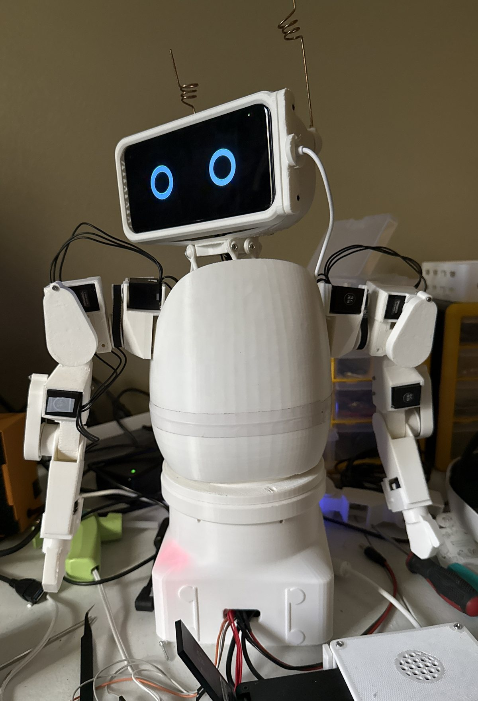

# Build a Reachy robot — start here

Six teams, six robots. Each team builds a complete **Reachy Mini–style robot**: a head that
nods, tilts and turns on six motors, two springy antennae, two arms, a body that turns on a
printed base, a phone for a face, and a Raspberry Pi for a brain. Then you make it yours: its
own name, its own voice, and if you like, its own head designed in Blender.

They are copies of **Ollie**. Everything in this book has been built and broken once already,
and the notes are what that taught.

*Ollie: the phone face in the head, the wire antennae, both arms fixed to the top of the body,
the base that turns, and the Raspberry Pi in its white case beside the base.*

| Read this | When |
|---|---|
| **This page** | Day one: what you're building, the six stages, teams, safety |
| [Stage 1 — Print](1_PRINT.md) | Every printed part, test prints first |
| [Stage 2 — Motor IDs](2_MOTORS.md) | Set up the Pi, give all 17 motors their own ID |
| [Stage 3 — Assembly](3_ASSEMBLY.md) | Put the robot together, with the Pi beside you |
| [Stage 4 — Software](4_SOFTWARE.md) | Name, calibration, arms, autostart, the phone face |
| [Stage 5 — Testing](5_TESTING.md) | The acceptance test, the Code Lab (Blockly and JavaScript), VR control |
| [Stage 6 — Make it yours](6_CUSTOMIZE.md) | Optional: a different phone, voice and eyes, your own head in [Blender](BLENDER.md) |
| [Appendix A — Shopping list](PARTS.md) | What to buy, per robot and for six |
| [Appendix B — Mentor notes](MENTOR_SETUP.md) | Mentors: the kit, SD cards, the network, the power wiring |

---

## What you are building

| Part of the robot | What it is | Motors |
|---|---|---|
| **Head** | A 6-motor *Stewart platform*: six motor arms push six rods that hold up the head. Moving them together makes it nod, tilt, turn and bob | 6 × XL330-M288 (IDs 4–9) |
| **Antennae** | Two bent-wire antennae on the back of the head — the robot's main way to show emotion | 2 × XL330-M077 (IDs 1–2) |
| **Arms** | Two 4-joint printed arms driven by belts: shoulder pitch, shoulder roll, elbow, wrist | 8 × XL330-M288 (right 14–17, left 18–21) |
| **Body** | The "egg" that holds the head motors. The arms screw to the top of it | — |
| **Base** | A printed plinth with a bearing on top; the whole robot turns on it | 1 × XC330-M288 (ID 3) |
| **Face** | A Samsung Galaxy S10 behind the face plate. Its screen is the eyes, its speaker is the voice. A cable keeps it charged | — |
| **Brain** | A Raspberry Pi 5 beside the base. It runs the robot's software and talks to the motors through a USB adapter (the **U2D2**) | — |

**Seventeen motors on one cable.** Every motor is daisy-chained on a single bus, and every
motor has an ID number. The ID is how the software knows which motor is which, so setting the
IDs is the first thing you do with the motors (Stage 2).

**The Pi is your workbench computer.** From Stage 2 on, every command in this book is typed on
your robot's own Pi, with a monitor, keyboard and mouse plugged into it. You don't need a
laptop. The only other computer you'll use is for Blender, if you design a head in Stage 6.

### The six stages

| Stage | What | Who | You're done when |
|---|---|---|---|
| **1 · Print** | Test prints, then every part | Print lead | Every part is printed, checked and labelled |
| **2 · Motor IDs** | Set up the Pi; give each motor its ID | Motors lead + software lead + mentor | A scan finds all 17 motors |
| **3 · Assembly** | Head, antennae, face, arms, base, power | Mechanical lead + motors lead + mentor | The robot is built and its head's "level" is recorded |
| **4 · Software** | Name, calibration, arms, autostart, phone | Software lead + mentor | The robot starts by itself, calibrated |
| **5 · Testing** | Acceptance test, Code Lab, VR | Whole team | Every box on the checklist is ticked |
| **6 · Make it yours** | Optional: phone, voice, eyes, your own head | Designer + everyone | Whenever you like |

Every stage ends in a **✅ checkpoint**. Don't start the next stage until your robot passes it,
and don't start a stage at all until the pilot robot (R1) has passed it. Where a step says
**mentor**, a mentor is at the table for it.

---

## How six teams build six robots

**Every robot has a number, R1 to R6, for its whole life.** Put it on everything: printed parts
(pencil or marker on a hidden face), motors (painter's tape), cables, the SD card, the phone,
the USB stick, the parts bin. Six robots' worth of identical parts on one table is how a
calibrated part ends up in the wrong robot.

**R1 is the pilot robot.** One team runs each stage a few days ahead of everyone else. The other
five start a stage only after R1 has passed its checkpoint. A problem gets found once, not six
times. The same goes for printing: print one of anything new, check it, then print five more.

**Parts that belong to one robot never move to another.** Motors (their IDs and positions are
recorded), rods, motor arms, the calibration file and the phone all get matched to one robot.
Swapping a calibrated part is how the robot on the next table starts moving wrong.

### Roles on a team (4–5 people)

| Role | Owns |
|---|---|
| **Print lead** | The team's print queue, slicer settings, labelling printed parts |
| **Motors & wiring lead** | Motor IDs, cables, the bus, strain relief, the power checks |
| **Mechanical lead** | Rods, motor arms, the head and neck, the arms and belts, the base |
| **Software lead** | The Pi, the phone, the robot's name and voice (with the mentor) |
| **Designer** | Optional: the robot's own head in Blender (everyone can help) |

Everyone owns safety.

---

## Safety — non-negotiable

1. **The motors are 5-volt parts.** The robot's power brick is 12 V, and a converter turns that
   into 5 V for the motors. 12 V on the motor bus destroys **every motor at once**. Only a
   mentor wires or changes the power parts, and the 5 V is measured with a meter before any
   motor is connected.
2. **Power off before you plug or unplug any motor cable.** Hot-plugging is how a motor gets a
   wrong ID or drops off the bus.
3. **Keep fingers out of the neck and the belts while the motors are powered.** Six motor arms
   and six rods make a pinch point, and so does every belt. Before you move the head or an arm
   by hand, it must be *limp* (torque off).
4. **An arm falls when it goes limp.** Hold it, or make sure nothing is under it, before you
   switch the motors off or press PANIC.
5. **Soldering only with a mentor present.** Eye protection, ventilation, iron in its stand.
6. **Hot water for the ball joints (80–90 °C)** — tongs or gloves, mentor present.
7. **Phones:** never put a phone with a swollen battery into the head. The phone charges inside
   the head, so check its back is still flat every time the head is opened.
8. **Printers:** don't touch the nozzle or the bed. PETG needs ventilation.
9. **VR:** the person in the headset can't see the real robot. Someone else always watches the
   robot, with a hand near the power switch.
10. **Children will touch this robot.** Nothing sharp: round every point and edge, including
    the ends of the antenna wire.

---

## Day one

1. **Form six teams**, give each a robot number (R1 = the pilot team) and assign roles.
2. **Safety briefing** — the list above, out loud.
3. **Start printing the test pieces** ([Stage 1](1_PRINT.md)). They answer "will it fit?"
   before anyone commits a ten-hour print. Also start the long, safe prints: `body_top`,
   `body_down`, `head_back`, `base_body`.
4. **Inventory what has arrived** against the [shopping list](PARTS.md). Label boxes R1–R6.
5. **Software leads:** set up your Pi ([Stage 2, step 1](2_MOTORS.md)). It can happen while the
   printers run.
6. **Designers:** if your team wants its own head, install Blender and sketch the character on
   paper first ([Blender](BLENDER.md)). Design runs alongside the build.

## Where the files are

Everything to print, and this book, is in the **ollie-3d** repository. Your team also gets a
**USB stick** from the mentor with the same files plus the robot software:

| Folder | What's in it | Where |
|---|---|---|
| `print/` | Every part for one robot, grouped in printing order. **All millimetres — print at 100 %.** `PRINT_LIST.csv` says how many of each and how to lay it on the bed | ollie-3d and the USB stick |
| `blender/` | The Blender starter file and its check script (Stage 6) | ollie-3d and the USB stick |
| `Reachy-Student-Build-Book.pdf` | This book, ready to print | ollie-3d and the USB stick |
| `software/` | `reachy-software.tar.gz` — the robot software, installed onto the Pi in Stage 2 | USB stick only |

Keep the stick: it's also where your robot's calibration file is backed up.

**Credits.** The stock Reachy Mini parts — the head back, crown cover, neck and Stewart
plates, antenna parts and body shells — are Pollen Robotics' designs, converted here to
millimetres. Everything else was designed for Ollie.
